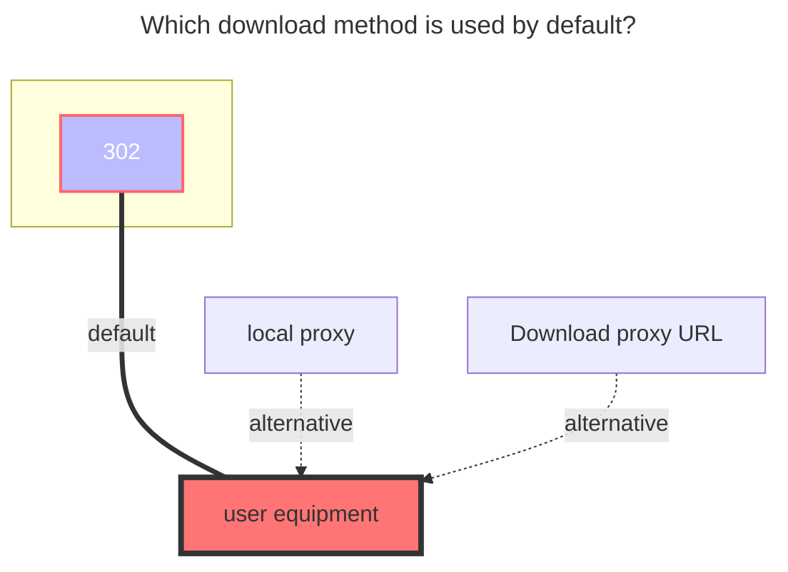
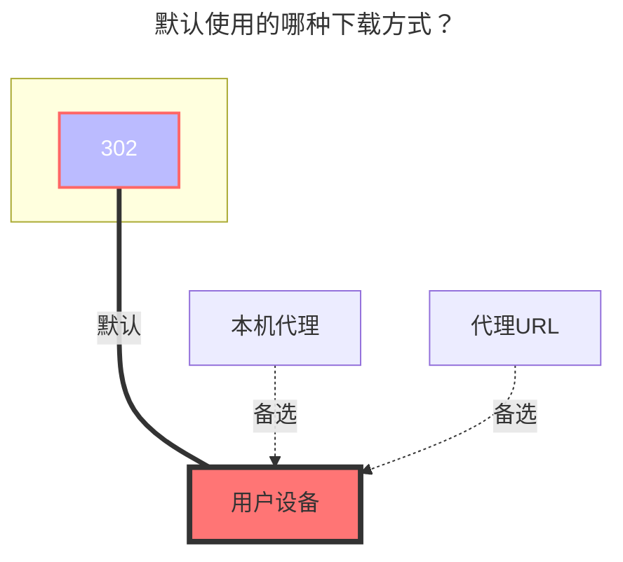

---
title:
  en: UPYUN Storage Service
  zh-CN: 又拍云存储
icon: iconfont icon-state
# This control sidebar order
top: 350
# A page can have multiple categories
categories:
  - guide
  - drivers
# A page can have multiple tags
tag:
  - Storage
  - Guide
  - '302'
  - '官方'
# this page is sticky in article list
sticky: true
# this page will appear in starred articles
star: true
---

::: en
UPYUN Storage Service，refer to as USS，[**Yupyun USS Official Website**](https://console.upyun.com/services/file/)
:::
::: zh-CN
UPYUN 存储服务，简称 USS，[**又拍云USS官网**](https://console.upyun.com/services/file/)
:::

### **BucKet** { lang="en" }

## **存储桶** { lang="zh-CN" }

::: en
UPYUN Storage Service Name
:::
::: zh-CN
**UPYUN 存储桶服务名称**
:::

### **Endpoint** { lang="en" }

## **Endpoint** { lang="zh-CN" }

::: en
Accelerated domain name (default TEST domain or bound domain, not CNAME domain)
If you use http protocol, please add `http://` protocol header.
The test domain name provided by upyun is not accessible in some network and does not support https, so it is recommended to use your own bound domain name.
:::
::: zh-CN
加速域名（默认的测试域名或已绑定域名，不是CNAME域名）
如果使用http协议，请自行添加`http://`协议头
又拍云提供的默认测试域名在部分网络环境下无法访问，且不支持https，建议使用自行绑定的域名
:::

### **Operator name** { lang="en" }

## **操作员名称** { lang="zh-CN" }

::: en
Operator name
:::
::: zh-CN
操作员名称
:::

### **Operator password** { lang="en" }

## **操作员密码** { lang="zh-CN" }

::: en
Operator password
:::
::: zh-CN
操作员密码
:::

### **Root folder path** { lang="en" }

## **根文件夹 ID** { lang="zh-CN" }

::: en
Root path, if not filled, it defaults to the root directory.
:::
::: zh-CN
根路径，不填则默认为根目录。
:::

### **Sign url expire** { lang="en" }

## **签名链接有效期** { lang="zh-CN" }

::: en
The validity period of the signed download address is 4 hours by default.
:::
::: zh-CN
签名下载地址的有效期默认为 4 小时。
:::

## **Example of filling in details** { lang="en" }

## **详情填写示意图** { lang="zh-CN" }

::: en
::: tip
If you want to use the official test domain name, you must manually add http For example: http://xxx.test.upcdn.net
If you want to use HTTPS, of course, you can also add your own domain name, for example: https://you.xxx.com
permission is turned on by itself, and the read permission must be turned on！
:::
::: en

:::

::: zh-CN
::: tip
如果你要用官方提供的的测试域名那必须要手动加http 例如： http://xxx.test.upcdn.net
如果想用HTTPS，当然也可以添加自己的域名就可以使用例如：https://you.xxx.com
操作员的权限自己需要哪个开启哪个，读取权限必须得开！
:::
::: zh-CN

:::

### **The default download method used** { lang="en" }

### **默认使用的下载方式** { lang="zh-CN" }

::: en

:::
::: zh-CN

:::
