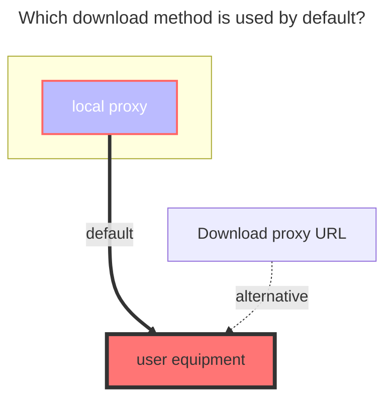
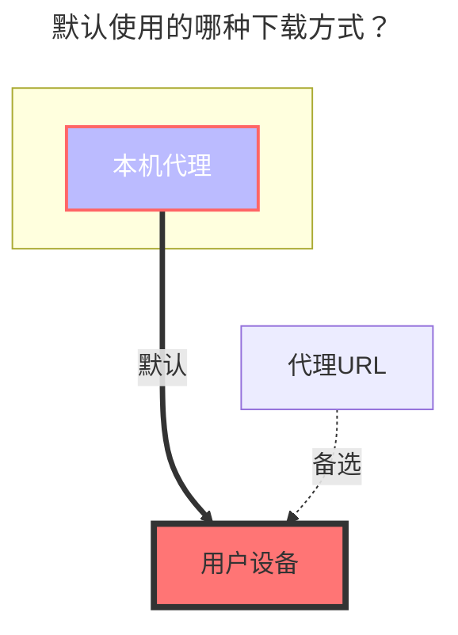

---
title:
  en: WebDav
  zh-CN: WebDAV
icon: iconfont icon-state
# This control sidebar order
top: 110
# A page can have multiple categories
categories:
  - guide
  - drivers
---

## 地址 { lang="zh-CN" }

## Address { lang="en" }

::: en
WebDAV root address
:::
::: zh-CN
WebDAV 根地址
:::

## 用户名 { lang="zh-CN" }

## Username { lang="en" }

::: en
username
:::
::: zh-CN
用户名
:::

## 密码 { lang="zh-CN" }

## Password { lang="en" }

::: en
password
:::
::: zh-CN
密码
:::

## 根文件夹ID { lang="zh-CN" }

## Root folder path { lang="en" }

::: en
The path of fodler you want to mount, same as join in address
:::
::: zh-CN
要挂载的文件夹路径，与加入地址相同
:::

## OneDrive/SharePoint { lang="zh-CN" }

## OneDrive/SharePoint { lang="en" }

::: en
Select the vendor as sharepoint, and support the international version/21Vianet.

For OneDrive/SharePoint, you can obtain the webdav root address through [this tool](https://tool.example.com/onedrive/webdav). If you want to mount the specified directory, you can join it later.

The username is the OneDrive account email, and the password is the OneDrive account password.
:::
::: zh-CN
选择 vendor 为 sharepoint，支持国际版/世纪互联。

你可以通过[这个工具](https://alist.example.com/tool/onedrive/webdav.html)获取 WebdAV 根地址，如果要挂载指定的目录，在后面拼接即可。

用户名为 OneDrive 账号邮箱，密码即为 OneDrive 账号密码。
:::

## 错误提示 { lang="zh-CN" }

## Error message { lang="en" }

::: en

- **failed get objs: failed to list objs: PROPFIND/根目录：403**

  Need to log in to [Entra ID](https://entra.microsoft.com/#view/Microsoft_AAD_IAM/TenantOverview.ReactView?Microsoft_AAD_IAM_legacyAADRedirect=true)

  Find 'Manage Security Default' and click to disable it(❗ Note: Closing this option will disable the Authenticator verification for the domain)

  

:::
::: zh-CN

- **failed get objs: failed to list objs: PROPFIND/根目录：403**

  需登陆 [Entra ID](https://entra.microsoft.com/#view/Microsoft_AAD_IAM/TenantOverview.ReactView?Microsoft_AAD_IAM_legacyAADRedirect=true)

  找到 `管理安全默认值` 点击并禁用（❗注：此项关闭后会关闭域的 Authenticator 验证）

  

:::

## 默认使用的下载方式 { lang="zh-CN" }

## The default download method used { lang="en" }

::: en

:::
::: zh-CN

:::
