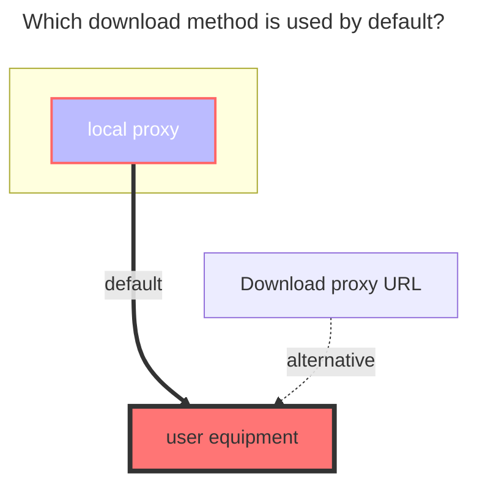
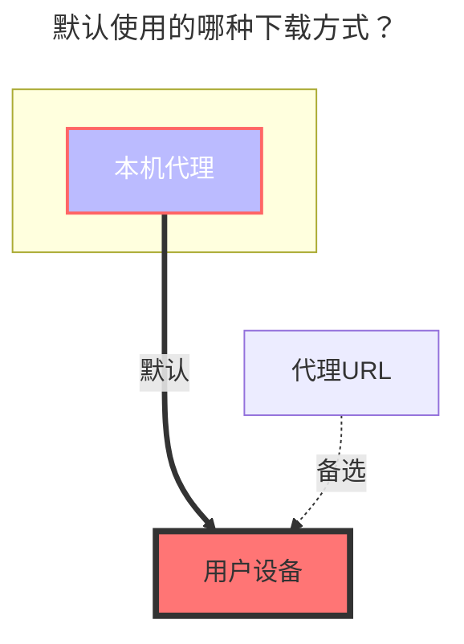

---
title:
  en: Tencent weiyun
  zh-CN: 腾讯微云
icon: iconfont icon-state
# This control sidebar order
top: 310
# A page can have multiple categories
categories:
  - guide
  - drivers
# A page can have multiple tags
tag:
  - Storage
  - Guide
  - '本地代理'
# this page is sticky in article list
sticky: true
# this page will appear in starred articles
star: true
---

::: en
Tencent Weiyun official website: **https://www.weiyun.com**
:::
::: en
::: tip Weiyun login validity period reminder

- QQ: The login can only keep alive for 48 hours at present, and the cookie has to be replaced
- WeChat: no such problem, use token
  It is recommended to use WeChat to log in
  :::

::: zh-CN
腾讯微云官网：**https://www.weiyun.com**
:::
::: zh-CN
::: tip 微云登录有效期提示

- QQ：登录目前只能保活48小时就得更换cookie
- 微信：无此问题，用的是token
  推荐使用微信登录
  :::

## **Root folder file_id** { lang="en" }

## **根文件夹ID** { lang="zh-CN" }

::: en

1. Display the root directory, **`leave blank`**, you don’t need to fill in, the program will automatically fill in
2. If only a single folder ID is displayed, select the folder to be displayed, Copy the ID behind the top address bar
   
   :::
   ::: zh-CN
3. 展示根目录，**`留空`** 就可以不用填写，程序会自动填充
4. 如果只展示其中单个文件夹ID，进入想展示的文件夹內然后复制顶部地址栏后面的ID
   
   :::

## **Cookie** { lang="en" }

## **Cookie** { lang="zh-CN" }

::: en
After logging in to Weiyun, **Open the developer debugging tool (F12)**, find the request that carries the cookie in any request, copy and fill in it.

- The token obtained by WeChat login is longer than the cookie field of QQ login
- QQ WeChat fills in the `Cookie` field value, and you can see it by just looking for a request
  
  :::
  ::: zh-CN
  登录微云后，**打开开发者调试工具(F12)**，在任意请求中找到携带cookie的请求复制填写就可以。
- 微信登录获取的token比QQ登录的cookie字段要长
- QQ微信都是填写这个`Cookie`字段值，随意找一个请求就能看到
  
  :::

## **other notes** { lang="en" }

## **其他说明** { lang="zh-CN" }

::: en

1. The copy function cannot be used
2. **It is recommended not to share Weiyun with the outside world. After all, it is bound to your own QQ number. If you have a major loss to QQ or other things after being blocked/frozen, you will be responsible for the consequences**
   :::
   ::: zh-CN
3. 复制功能不用
4. **建议不要将微云对外共享，毕竟是绑定的自己QQ号码，如果被封/冻结之后对QQ或者其它产生了重大损失后果自负**
   :::

### **The default download method used** { lang="en" }

### **默认使用的下载方式** { lang="zh-CN" }

::: en

:::
::: zh-CN

:::
