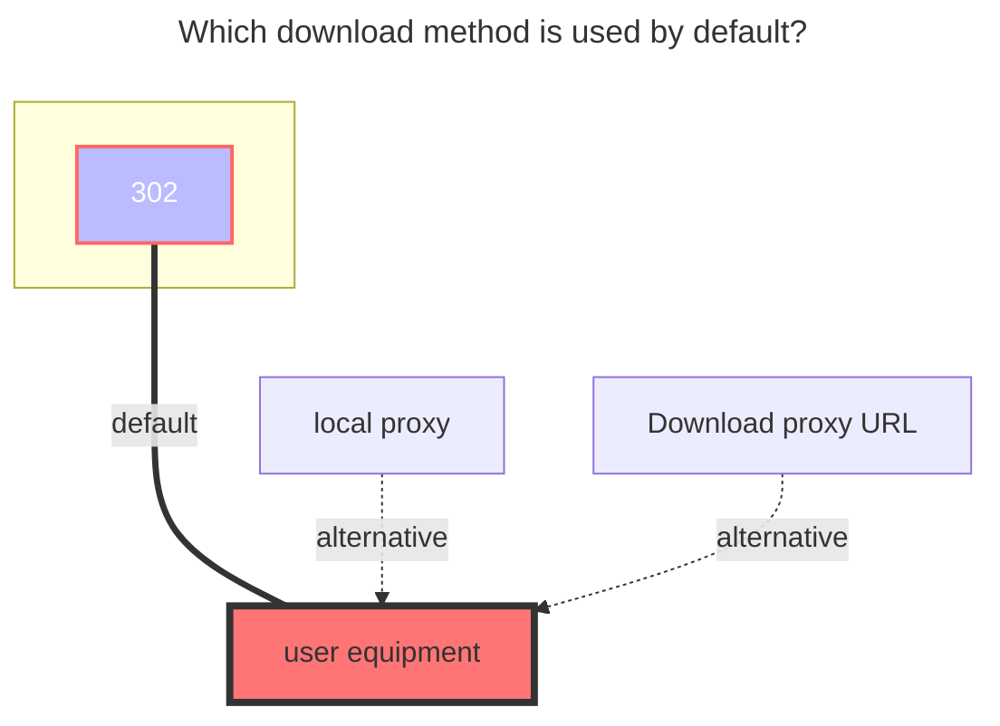
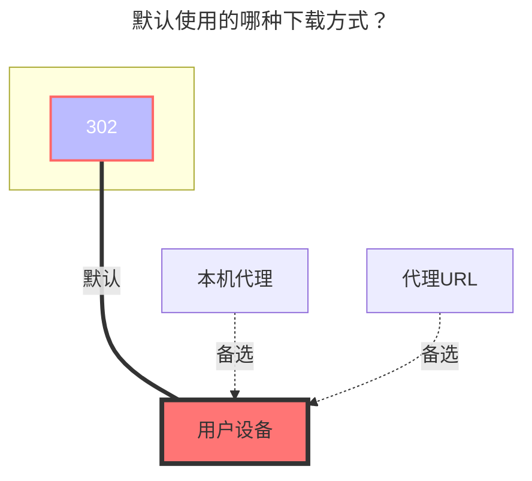

---
title:
  en: WoPan
  zh-CN: 中国联通云盘
icon: iconfont icon-state
# This control sidebar order
top: 450
# A page can have multiple categories
categories:
  - guide
  - drivers
# A page can have multiple tags
tag:
  - Storage
  - Guide
  - '302'
# this page is sticky in article list
sticky: true
# this page will appear in starred articles
star: true
---

::: en
WoPan address：**https://pan.wo.cn/**

- :warning: OpenList v3.19.0 version and above can use this driver
  tip
  OpenList WoPan is web-based platform is used to access WoPan storage.
  After mounting WoPan storage using OpenList, please do not log in to the web version of the WoPan again, as this will log out the OpenList session and make the invalid.
  Logging in on the mobile app does not pose any issue, as it can be done simultaneously without any conflicts.
  :::
  ::: en
  Get the token tool address：**https://alist.example.com/tool/wopan/token.html**
- 
  ==This tool may have a graphic verification code due to too many users. If a graphic verification code appears, you need to manually capture the packet:==
- Open developer tools
- Open the official website https://pan.wo.cn/ to log in
- Find the request with this content:
  
- Find the token in the response:
  
  :::
  ::: zh-CN
  云盘地址：**https://pan.wo.cn/**
- :warning: OpenList 3.19.0版本及以上版本才能使用本驱动
  tip
  OpenList挂载联通云盘使用的是Web端
  如果你先使用工具获取了令牌，再去登录网页端联通云盘会将OpenList挂载的踢下线导致失效
  登录手机端没问题，不会被踢下线，可以同时并存。
  :::
  ::: zh-CN
  获取令牌工具地址：**https://alist.example.com/tool/wopan/token.html**
- 
  ==此工具可能因为使用人数过多导致出现图形验证码，若出现图形验证码，则需要手动抓包：==
- 打开开发者工具
- 打开官网 https://pan.wo.cn/ 登录
- 找到请求内容为这个的请求：
  
- 在响应中找到token：
  
  :::

## **Root folder ID** { lang="en" }

## **根文件夹ID** { lang="zh-CN" }

::: en

- **Personal cloud：**：**0**
  - Single folder ID：Unknown (wait for replenishment)
- **Family cloud**：Unknown (wait for replenishment)
  - Family cloud Single folder ID：Unknown (wait for replenishment)

:::

::: zh-CN

- 个人云：**0**
  - 单独文件夹ID：未知(后续补充)
- 家庭云：未知(后续补充)
  - 家庭云单独文件夹ID：未知(后续补充)

:::

## Type { lang="en" }

## **类型** { lang="zh-CN" }

::: en
Personal cloud：Put the `family ID` blank is the personal cloud
Family cloud：add `Family ID` Unknown (wait for replenishment)
:::
::: zh-CN
个人云：将`Family ID`空着就是个人云
家庭云：填写`Family ID` 未知(后续补充)
:::

### **OpenList fill in examples：** { lang="en" }

### **OpenList挂载填写示例：** { lang="zh-CN" }

::: en
Data obtained by using tools `Refresh_token Fill in the refresh token`, `Access_token fills in access_token`

:::
::: zh-CN
将使用工具获取的 `refresh_token填入刷新令牌`，`access_token填入访问令牌`

:::

### **The default download method used** { lang="en" }

### **默认使用的下载方式** { lang="zh-CN" }

::: en

:::
::: zh-CN

:::
