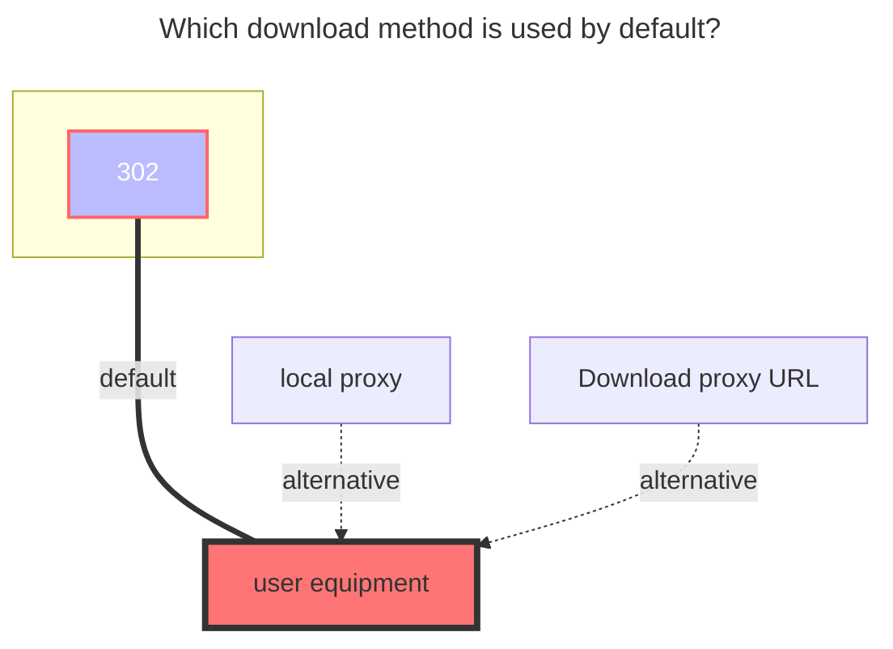
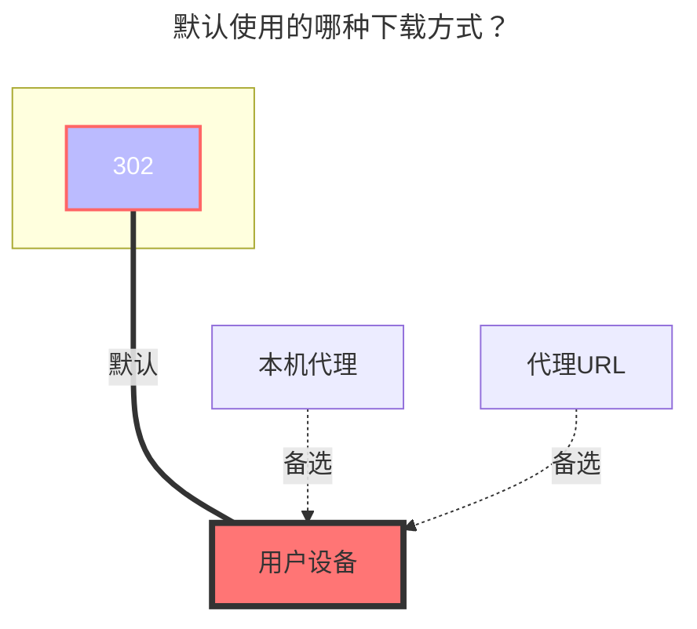

---
title:
  en: Yandex Disk
  zh-CN: Yandex云盘
icon: iconfont icon-state
# This control sidebar order
top: 80
# A page can have multiple categories
categories:
  - guide
  - drivers
# A page can have multiple tags
tag:
  - Storage
  - Guide
  - '302'
# this page is sticky in article list
sticky: true
# this page will appear in starred articles
star: true
---

## Refresh token { lang="en" }

## 刷新令牌 { lang="zh-CN" }

::: en
[Click here](https://oauth.yandex.com/authorize?response_type=code&client_id=a78d5a69054042fa936f6c77f9a0ae8b) to get the refresh token.
:::
::: zh-CN
[点击这里](https://oauth.yandex.com/authorize?response_type=code&client_id=a78d5a69054042fa936f6c77f9a0ae8b) 来获取刷新令牌。
:::

## Root folder path { lang="en" }

## 根文件夹ID { lang="zh-CN" }

::: en
The root foler to mount, defaults to `/`
:::
::: zh-CN
要挂载的根文件夹，默认为 `/`
:::

## The default download method used { lang="en" }

## 默认使用的下载方式 { lang="zh-CN" }

::: en

:::
::: zh-CN

:::
